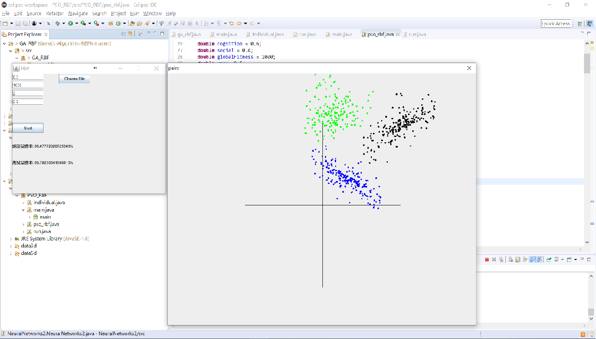

# Backpropagation 
## Neural Network Project2
    Implement backpropagation neural network with GUI 
### Program
    Input: Data, learning rate, ending condition, layers of netwok, neutrons of each network
    Output: testing/training success rate
## Dataset
[Dataset](./Dataset)
## Example
### 2Circle1
  

### 579
  